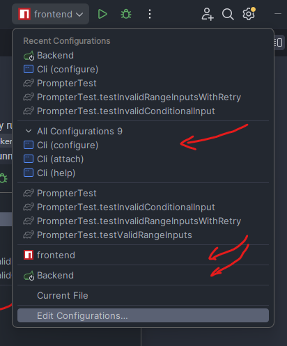

# Object-Oriented Programming Coursework I

- Author: Rachala Ovin Gunawardana
- IIT ID: 20220945
- UoW ID: 20527356

## Prerequisites

1. JDK version >= 23.0.1
2. Node version ~= 22.12.0 (mentioned in [.node-version](./.node-version))
3. Pnpm version ~= 9.15.0 (managed by corepack)

## Starting up

1. Complete the configuration step by running the `Cli (configure)` application.
2. Start the backend by running `Backend` application through IDEA configuration.
3. Start the frontend application by running the `frontend` configuration.
   

## Swagger and OpenAI

After the backend is started, the below are available:

1. Swagger UI documentation: http://localhost:8080/swagger-ui.html
2. OpenAPI JSON data: http://localhost:8080/v3/api-docs
